# EasyStay! 🏡✨

Welcome to **EasyStay** – our microservices-based booking platform that simplifies the search for rental accommodations.
With **EasyStay**, you can easily find and book housing while ensuring a smooth payment and notification process.

## 🌟 Features

- **Perimeter Security Architecture**: Centralized authentication via API Gateway & Auth Service (JWT). Internal services operate in a trusted zone for high performance.
- **SAGA Pattern Orchestration**: Reliable distributed transactions managed by the Booking Service to ensure data consistency across payments and reservations.
- **Event-Driven Architecture**: Asynchronous communication via RabbitMQ for notifications and payment processing updates.
- **Hidden Microservices**: The Address Service is encapsulated behind the Accommodation Service, ensuring strict domain boundaries.
- **Hybrid Tech Stack**: Demonstrates microservice autonomy by mixing **Java 17 (Maven)** and **Java 21 (Gradle)** within the same ecosystem.
- **Payment Integration**: Secure payment processing with Stripe API and Webhooks.
- **Caching & Performance**: Redis for high-speed data access and optimized database indexing.
- **Observability**: Distributed tracing with Zipkin, metrics monitoring with Prometheus,
  and centralized logging with Promtail, Loki, and Grafana.

---

## 🏗️ Architecture

The project follows a **Microservices Architecture** with **Perimeter Security**.

* **Security:** The API Gateway acts as the single entry point, handling JWT validation and routing. Internal services trust requests forwarded by the Gateway.
* **Orchestration:** The `Booking Service` acts as the SAGA orchestrator, managing the lifecycle of a reservation (Pending -> Paid -> Confirmed).
* **Data Flow:**
  * **Synchronous (Feign):** Used for read-only operations (e.g., getting accommodation details).
  * **Asynchronous (Kafka):** Used for transactional operations (SAGA - Creating a booking).
  * **Asynchronous (RabbitMQ):** Used for non-transactional events (Sending Email/Telegram/Sms notifications).

```mermaid
graph TD
    %% --- Стили и группы ---
    classDef gateway fill:#ffecb3,stroke:#ffc107,stroke-width:2px;
    classDef auth fill:#ffcdd2,stroke:#e57373,stroke-width:2px;
    classDef booking fill:#c8e6c9,stroke:#81c784,stroke-width:3px;
    classDef service fill:#e1f5fe,stroke:#4fc3f7,stroke-width:2px;
    classDef hidden fill:#f5f5f5,stroke:#bdbdbd,stroke-width:2px,stroke-dasharray: 5 5;
    classDef db fill:#dcedc8,stroke:#aed581,stroke-width:2px;
    classDef queue fill:#e0e0e0,stroke:#9e9e9e,stroke-width:2px;
    classDef external fill:#fff9c4,stroke:#fbc02d,stroke-width:2px,stroke-dasharray: 5 5;
    classDef infra fill:#e0f7fa,stroke:#00bcd4,stroke-width:1px,stroke-dasharray: 2 2;
    
    %% Новые стили для брокеров
    classDef kafka fill:#ff9800,stroke:#e65100,stroke-width:2px,color:white;
    classDef rabbit fill:#ff7043,stroke:#bf360c,stroke-width:2px,color:white;

    %% --- Актеры ---
    User(👤 Customer / Manager)
    StripeWebhook(⚡ Stripe Webhook)

    %% --- Инфраструктура ---
    subgraph Infra [Infrastructure]
        Eureka[Eureka Discovery]:::infra
        Config[Config Server]:::infra
        Zipkin[Zipkin & Prometheus]:::infra
        Logging[Promtail → Loki → Grafana]:::infra
        Redis[Redis Cache]:::infra
    end

    %% --- Периметр безопасности (Вход) ---
    subgraph Security Perimeter [Security Perimeter]
        Gateway(🛡️ API Gateway):::gateway
        Auth(Auth Service):::auth
        AuthDB[(Auth DB)]:::db
    end

    %% --- Внутренняя сеть микросервисов ---
    subgraph Trusted Zone [Trusted Zone / Docker Net]
        %% Брокеры сообщений (Добавлено)
        Kafka((Apache Kafka\nSAGA Events)):::kafka
        RabbitMQ((RabbitMQ\nNotifications)):::rabbit
        
        %% Оркестратор - ИСПРАВЛЕНО ТУТ (убраны скобки < > и добавлены кавычки)
        Booking("Booking Service\nSAGA Orchestrator"):::booking
        BookingDB[(Booking DB)]:::db

        %% Сервисы-участники
        Accommodation(Accommodation Service):::service
        AccDB[(Acc. DB)]:::db
        
        %% Скрытый сервис - ИСПРАВЛЕНО ТУТ (добавлены кавычки)
        Address("Address Service\nJava 21 + Gradle"):::hidden
        AddrDB[(Addr. DB)]:::db

        Payment(Payment Service):::service
        PaymentDB[(Payment DB)]:::db

        Notification(Notification Service):::service

    end

    %% --- Внешние системы ---
    subgraph External [External APIs]
        StripeAPI[💳 Stripe API]:::external
        TelegramAPI[✈️ Telegram / Email]:::external
    end

    %% --- Связи (Поток данных) ---

    %% 1. Авторизация и вход
    User -->|1. Login/Register| Gateway
    Gateway -->|Proxy| Auth
    Auth <--> AuthDB
    Auth -->|JWT Token| Gateway

    %% 2. Основные запросы (с токеном)
    User -->|2. Request with JWT| Gateway
    Gateway -->|3. Route & Header Propagation| Booking
    Gateway -->|Route| Accommodation
    Gateway -->|Route| Payment

    %% 3. Синхронные вызовы (FeignClient HTTP)
    %% ИСПРАВЛЕНО ТУТ (текст в кавычках)
    Booking -->|"HTTP GET (Feign)"| Accommodation
    Accommodation -->|Internal Call| Address
    Address <--> AddrDB

    %% 4. SAGA Оркестрация (Бронирование) через Kafka
    Booking <--> BookingDB
    Booking -- "1. Booking PENDING" --> BookingDB

    %% SAGA Шаг 1: Инвентаризация (Kafka)
    Booking -- "2. Event: booking.created" --> Kafka
    Kafka -- "3. Consume" --> Accommodation
    Accommodation <--> AccDB
    Accommodation -- "4. Event: inventory.reserved/failed" --> Kafka
    Kafka -- "5. Consume Result" --> Booking
    Booking -- "6. Update Status" --> BookingDB

    %% SAGA Шаг 2: Оплата (Kafka - заготовка)
    Booking -.->|"Next: Initiate Payment"| Kafka
    Kafka -.-> Payment
    Payment <--> PaymentDB
    Payment -->|Create Session| StripeAPI
    StripeAPI -- "Payment Link" --> Payment

    %% Обработка Webhook от Stripe
    StripeWebhook -->|Payment Success| Gateway
    Gateway -->|Proxy| Payment

    %% SAGA Шаг 3: Уведомления (RabbitMQ)
    Booking -- "Async Notification" --> RabbitMQ
    RabbitMQ -- "Listen" --> Notification
    Notification -->|Send| TelegramAPI
    
    %% Config Connections (Hidden for clarity but implied)
    Gateway -.-> Eureka
    Booking -.-> Zipkin
```


---

## 🚀 Getting Started

Follow these simple steps to set up and run the project locally.

### 📌 1. Prerequisites
Make sure you have installed:
- **Java 17** (Main services) & **Java 21** (Address Service)
- **Maven** & **Gradle**
- Docker & Docker Compose
- PostgreSQL (optional, as the database runs in Docker)

### 📌 2. Clone the Repository
```bash
git clone https://github.com/ilko-ilya/easystay-microservices
```

### 3️⃣ Build and Run Docker Containers
```bash
docker-compose build
docker-compose up -d
```

### 4️⃣ Access the Application
Once running, the EasyStay app will be available at:
- **API Gateway**: [http://localhost:8222](http://localhost:8222)
- **Swagger Docs**: [http://localhost:8222/swagger-ui.html](http://localhost:8222/swagger-ui.html)
- **Eureka Dashboard**: [http://localhost:8761](http://localhost:8761)
- **Kafka UI**: [http://localhost:9000](http://localhost:9000)
- **Zipkin Tracing**: [http://localhost:9411](http://localhost:9411)

## 📌 API Endpoints

### 🔐 Authentication (Public Endpoints)
#### Register
```http
POST /api/auth/register
```
**Request Body:**
```json
{
  "email": "john.doe@gmail.com",
  "password": "password123",
  "repeatPassword": "password123",
  "firstName": "John",
  "lastName": "Doe"
}
```

#### Login
```http
POST /api/auth/login
```
**Request Body:**
```json
{
  "email": "john.doe@gmail.com",
  "password": "password123"
}
```

### 🏡 Accommodation Service
#### View Available Listings
```http
GET /api/accommodations
```
#### Get Accommodation by ID
```http
GET /api/accommodations/{id}
```
#### Create a New Accommodation (MANAGER only)
```http
POST /api/accommodations
```
#### Update an Accommodation (MANAGER only)
```http
PUT /api/accommodations/{id}
```
#### Delete an Accommodation (MANAGER only)
```http
DELETE /api/accommodations/{id}
```

### 📅 Booking Service
#### Create a Booking (CUSTOMER only)
```http
POST /api/bookings
```
**Request Body:**
```json
{
  "accommodationId": 123,
  "checkInDate": "2024-04-01",
  "checkOutDate": "2024-04-10"
}
```
#### View Your Bookings
```http
GET /api/bookings/my
```
#### View Booking by ID
```http
GET /api/bookings/{id}
```
#### Cancel Booking
```http
DELETE /api/bookings/{id}
```

### 💳 Payment Service
#### View Payments
```http
GET /api/payments/my
```

### ✉️ Notification Service
#### Send a Test Notification
```http
POST /api/notifications/send
```

## ⚙️ Technologies Used
- **Backend:** Java 17, Java 21 (Address Service), Spring Boot 3
- **Build Tools:** Maven, Gradle
- **Security:** Spring Security, JWT (Perimeter Security Pattern)
- **API & Communication:** REST, Feign Client, OpenAPI (Swagger)
- **Database:** PostgreSQL, Liquibase
- **Infrastructure:** Docker, Eureka Service Discovery, Config Server, Redis
- **Payments:** Stripe API & Webhooks
- **Messaging:** Apache Kafka (Core SAGA Orchestration), RabbitMQ (Event-Driven)
- **Logging & Monitoring:** Zipkin, Prometheus, Promtail (Loki stack)

## 🎯 Future Enhancements
- Implement Admin dashboard for better management.
- Add support for multiple payment providers.
- Enhance security measures and OAuth authentication.

## 📞 Contact & Support
If you have any questions, feel free to reach out:
- Email: support@easystay.com
- Phone: +123 456 7890

Thank you for choosing EasyStay! 🚀🏡✨